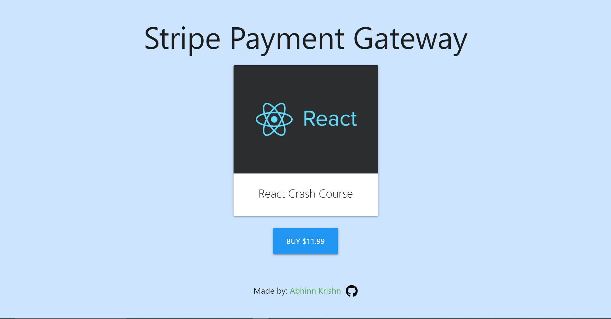

# Stripe Payment Gateway Integration

This is a demonstration of how to integrate Stripe Payment Gateway to a React Project.

# How to Install and Run in your local machine

### Install and Run the Frontend

### `cd /stripe-frontend`

### `npm install`

### `npm start`

### Install and Run the Backend

### `cd ../stripe-backend `

### `npm install`

### `npm start`

### See the Changes Visually

Visit: `localhost:3000` in you browser if it automatically does not open.
