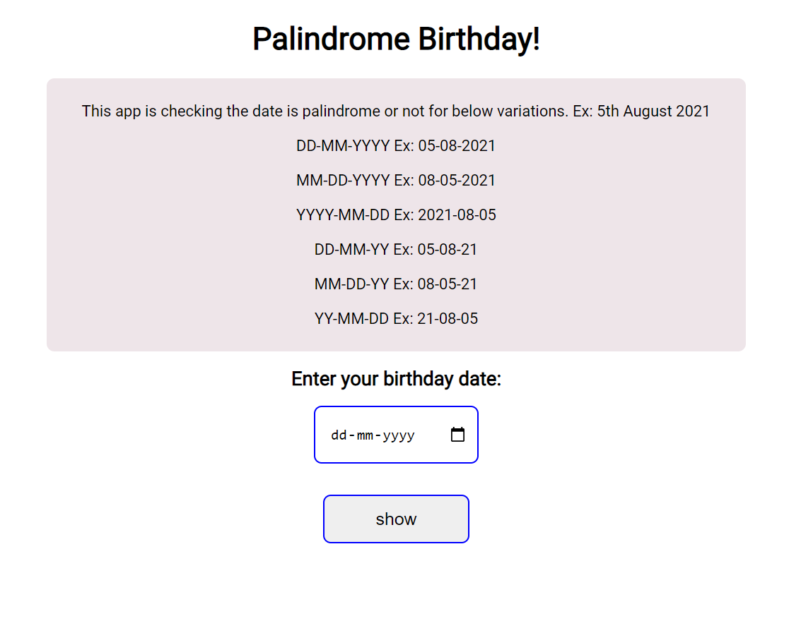

## **Palindrome Birthday App**

This is a palindrome birthday checker app that will check whether your birthday is a palindrome or not for a given variations of date formats and will tell the nearest palindrome date and also how many days your birthday missed the nearest palindrome date.

## Interface of the app

## How to use the app:

1. Enter the birth date.

2. Click on show to check whether your birthday is palindrome or not.

3. Output: 
    - Shows the birthday is palindrome or not with a cake. 
    - Shows the nearest Palindrome Birthday.

## Tech Stack Used:
1. HTML5
2. CSS3
3. Javascript

## Link of the app.

[Palindrome Birthday](https://rohit-mark-13-palindrome-birthday.netlify.app/)